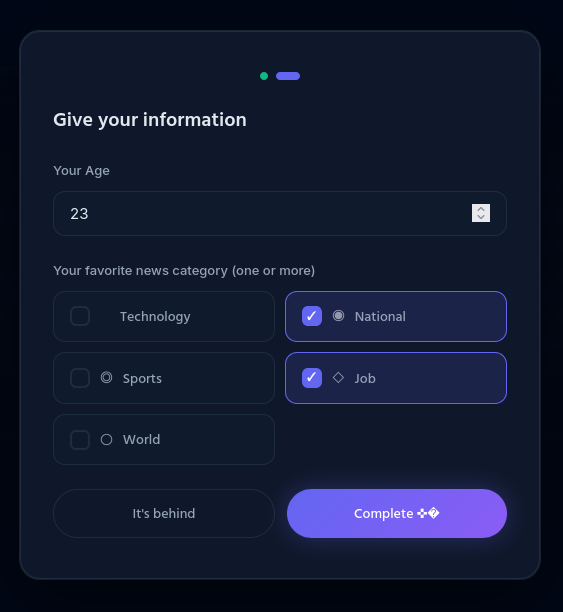
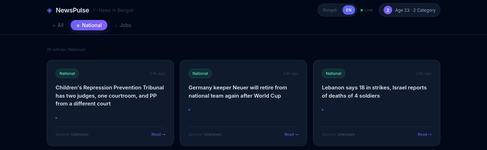

# NewsPulse

### *An Intelligent Personalised News Aggregation and Content Delivery Platform*

<p align="center">
  <strong>Transforming Information Consumption Through Adaptive Filtering, Real-Time Data Synchronisation, and User-Centric News Personalisation.</strong>
</p>

---

## Abstract

The contemporary digital ecosystem generates an unprecedented volume of information every second. While access to news has become easier than ever, identifying relevant, trustworthy, and personalised content remains a significant challenge for users. NewsPulse addresses this problem through an intelligent news aggregation framework that dynamically adapts content delivery according to individual user preferences, demographic attributes, and thematic interests.

By integrating real-time data synchronisation, automated content processing pipelines, and adaptive interface filtering, NewsPulse creates a focused and efficient information consumption experience while significantly reducing cognitive overload.

---

<h1 align="center">System Demonstration</h1>

<p align="center">
  
</p>

<p align="center">
  <em>
  Figure 1. Initial onboarding interface introducing the NewsPulse ecosystem.
  The system presents core platform capabilities and prepares users for
  personalised news configuration.
  </em>
</p>

<br><br>

<p align="center">
  
</p>

<p align="center">
  <em>
  Figure 2. User preference acquisition module. Demographic attributes and
  category interests are collected to construct an adaptive content profile,
  enabling personalised information delivery.
  </em>
</p>

<br><br>

<p align="center">
  
</p>

<p align="center">
  <em>
  Figure 3. Dynamically personalised news dashboard displaying only relevant
  categories selected during onboarding. Real-time content updates and
  intelligent filtering reduce information overload while improving content
  discoverability.
  </em>
</p>


# Table of Contents

* Introduction
* Research Motivation
* System Architecture
* User Personalisation Framework
* Core Functionalities
* Technical Implementation
* Installation & Deployment
* Scalability Considerations
* Future Research Directions
* Author

---

# Introduction

NewsPulse is a next-generation news aggregation platform engineered to provide a personalised, responsive, and intelligent news consumption experience. Unlike conventional news feeds that present identical content to all users, NewsPulse employs adaptive filtering mechanisms to curate content streams that align with each user's interests and behavioural preferences.

The platform combines modern web technologies with real-time database infrastructure to deliver a seamless and continuously updated news ecosystem.

---

# Research Motivation

Information overload has emerged as one of the defining challenges of the digital age. Users are frequently exposed to excessive volumes of content, much of which is irrelevant to their interests or needs.

NewsPulse was conceived to address three fundamental challenges:

* Excessive information density in modern news platforms.
* Lack of meaningful personalisation in conventional news feeds.
* Inefficient content discovery mechanisms that increase cognitive effort.

The project explores how intelligent filtering and adaptive user profiling can improve engagement while preserving information relevance.

---

# System Architecture

The platform adopts a lightweight, scalable, and serverless architectural model designed for performance and maintainability.

## Frontend Layer

* HTML5
* Vanilla JavaScript (ES6+)
* Custom CSS Architecture
* Responsive User Interface Design

The frontend follows a minimalist design philosophy that prioritises readability, accessibility, and user focus.

---

## Backend Infrastructure

### Supabase

The backend ecosystem is powered by Supabase and leverages:

* PostgreSQL Database Engine
* Real-Time Data Synchronisation
* Row-Level Security
* Scalable API Layer

This architecture enables efficient content retrieval while maintaining low operational complexity.

---

## Content Automation Pipeline

A Node.js-driven automation framework manages:

* Content Collection
* Parsing and Normalisation
* Automated Translation
* Database Synchronisation

The pipeline continuously processes incoming news sources and prepares them for user delivery.

---

## Deployment Environment

The application is deployed through a modern Continuous Integration and Continuous Deployment (CI/CD) workflow using Vercel.

Key benefits include:

* Automated deployments
* Global CDN distribution
* Edge optimisation
* High availability infrastructure

---

# User Personalisation Framework

NewsPulse implements a multi-stage onboarding and preference modelling system.

## Initial Onboarding

New users are guided through a lightweight onboarding process designed to capture core preference signals.

### Demographic Profiling

Users provide:

* Age Group
* Preferred News Categories
* Areas of Interest

Examples include:

* Technology
* National Affairs
* International Affairs
* Sports
* Business
* Entertainment

---

## Persistent Preference Storage

User preferences are stored locally using browser storage mechanisms.

This approach ensures:

* Fast retrieval
* Reduced backend dependency
* Session continuity
* Improved user experience

---

## Adaptive Content Delivery

Following onboarding, the platform dynamically restructures navigation and content feeds according to the user's selected interests.

As a result:

* Irrelevant categories are removed.
* Navigation complexity is reduced.
* User attention is directed toward meaningful content.
* Information discovery becomes significantly more efficient.

---

# Core Functionalities

## Intelligent Category Filtering

The navigation layer automatically adapts to user preferences, displaying only relevant categories and eliminating unnecessary interface clutter.

---

## Real-Time News Synchronisation

Leveraging Supabase Real-Time Channels, NewsPulse instantly delivers newly published articles without requiring page refreshes.

This creates a continuously updated reading experience.

---

## Automated Localisation Pipeline

The system aggregates content from multiple external sources and automatically processes translations for Bengali-speaking audiences.

This enables broader accessibility while preserving content relevance.

---

## Ephemeral Content Lifecycle

To maintain freshness and reduce informational stagnation, NewsPulse employs a 24-hour content retention model.

Benefits include:

* Higher relevance
* Reduced outdated content exposure
* Improved feed quality
* Enhanced user engagement

---

# Technical Implementation

| Component         | Technology                     |
| ----------------- | ------------------------------ |
| Frontend          | HTML5, JavaScript (ES6+), CSS3 |
| Backend           | Supabase                       |
| Database          | PostgreSQL                     |
| Real-Time Updates | Supabase Channels              |
| Automation        | Node.js                        |
| Deployment        | Vercel                         |
| Storage           | LocalStorage                   |

---

# Installation & Deployment

## Prerequisites

Before deployment, ensure the following dependencies are available:

* Node.js
* Supabase Project
* Vercel CLI

---

## Repository Setup

```bash
git clone https://github.com/yourusername/newspulse.git

cd newspulse
```

## Environment Configuration

Configure the required environment variables:

```env
SUPABASE_URL=your_project_url

SUPABASE_ANON_KEY=your_project_key
```

## Production Deployment

```bash
vercel --prod
```

---

# Scalability Considerations

Future infrastructure upgrades may include:

* Distributed caching layers
* AI-powered recommendation systems
* Edge-side content processing
* Multi-language content support
* Behavioural analytics integration

These improvements will enable NewsPulse to support significantly larger user populations while maintaining low latency and high reliability.

---

# Future Research Directions

## AI-Assisted News Summarisation

Integration of Large Language Models (LLMs) to generate concise, context-aware article summaries.

---

## Predictive Content Recommendation

Machine learning models capable of forecasting user interests based on behavioural patterns.

---

## Intelligent Push Notification Framework

Real-time event detection and personalised breaking-news notifications.

---

## Advanced User Interface Personalisation

Custom themes, accessibility controls, and adaptive layout configurations based on individual usage behaviour.

---

# Conclusion

NewsPulse demonstrates how intelligent filtering systems, adaptive user modelling, and real-time content delivery can significantly improve the modern news consumption experience. By prioritising relevance over volume, the platform aims to reduce information overload while empowering users with timely, personalised, and meaningful access to news.

---

# Author

**Nahid Mahmud **

Building intelligent digital products that simplify information discovery through data-driven personalisation and modern web technologies.
